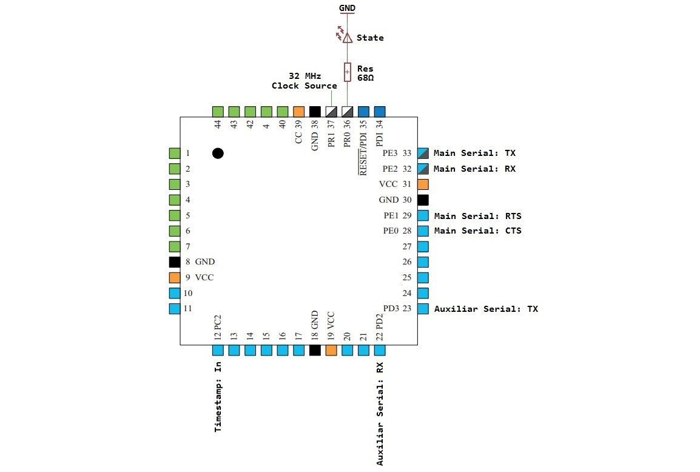

# Harp Core ATxmega

A Harp core for the ATxmega family of microcontrollers that implements the [Harp standard](https://github.com/harp-tech/protocol) to serve as the basis of Harp device firmware.

## What is the Harp core for the ATxmega?

The core is distributed as a static library, built for each supported microcontroller, that the firmware of each Harp device links against. It provides the common functionality that every device needs. Specifically, it:

* Handles the serial communication with the Controller, including the transmit and receive buffers
* Parses requests from the Controller and sends replies and events following the [Harp Binary Protocol](https://harp-tech.org/protocol/BinaryProtocol-8bit.html)
* Implements the core registers and device operation defined in [Device Registers and Operation](https://harp-tech.org/protocol/Device.html), and routes requests for application registers to the device firmware
* Manages the timestamp and synchronizes it to the [Harp Synchronization Clock](https://harp-tech.org/protocol/SynchronizationClock.html)
* Initializes and handles the microcontroller clock

The clock generator build of the core instead transmits the Harp Synchronization Clock itself, with every byte timed to the device clock.

## What can I find in this repository?

The source code of the Harp library for the ATxmega is in the **firmware** folder, and the source of its documentation is in the **docs** folder.

## How do I get set up?

### Compile the core

ATxmega is a family of microcontrollers originally developed by Atmel and now provided by [Microchip](https://www.microchip.com/). The code is developed and built with Microchip Studio.

1. Install [Microchip Studio](https://www.microchip.com/en-us/tools-resources/develop/microchip-studio) 7.0.2594, formerly Atmel Studio 7, which includes version 3.6.2.1778 of the AVR 8-bit Toolchain.
2. Open the solution file **core.atxmega.atsln**.
3. To compile, use the command **Build > Rebuild Solution**, or the shortcut Ctrl+Alt+F7.
4. The output libraries, which are the files with extension **.a**, can be found in the folder **firmware/bin**.

### Choose the right microcontroller connections

Harp devices use two packages, with 44 and 100 pins. Besides more GPIOs, the main advantage of the 100-pin package is that it offers more timers.

#### Connections for the 44-pin version using the ATxmega128A4U

**Note:** A good 32 MHz clock source is recommended, such as the MEMS oscillator DSC1001CI5-032.0000T from [Microchip](https://www.microchip.com/), which can be found on [Mouser](https://www.mouser.com/) or [Digi-Key](https://www.digikey.com/).

#### Connections for each supported microcontroller

| **Signal**           | [ATxmega32A4U](https://www.microchip.com/en-us/product/ATxmega32A4U) | [ATxmega64A4U](https://www.microchip.com/en-us/product/ATxmega64A4U) | [ATxmega128A1U](https://www.microchip.com/en-us/product/ATxmega128A1U) | [ATxmega128A4U](https://www.microchip.com/en-us/product/ATxmega128A4U) | [ATxmega16A4U](https://www.microchip.com/en-us/product/ATxmega16A4U), clock generator |
|-|-|-|-|-|-|
| Main Serial: CTS     | PE0                 | PE0                 | PJ6                  | PE0                  | PE0                         |
| Main Serial: RTS     | PE1                 | PE1                 | PK0                  | PE1                  | PE1                         |
| Main Serial: RX      | PE2                 | PE2                 | PF2                  | PE2                  | PE2                         |
| Main Serial: TX      | PE3                 | PE3                 | PF3                  | PE3                  | PE3                         |
| Sync Clock: RX       | PC2                 | PD6                 | PC6                  | PC2                  | Not used                    |
| Sync Clock: TX       | Not used            | Not used            | Not used             | Not used             | PD7                         |
| State LED            | PR0                 | PD5                 | PA6                  | PR0                  | PD5                         |
| Auxiliary Serial: RX | Not used            | Not used            | Not used             | PD2                  | Not used                    |
| Auxiliary Serial: TX | Not used            | Not used            | Not used             | PD3                  | Not used                    |
| Transmit Buffer      | 2048 bytes          | 2048 bytes          | 5120 bytes           | 5120 bytes           | 512 bytes                   |
| **Library to Use**   | *libATxmega32A4U*   | *libATxmega64A4U*   | *libATxmega128A1U*   | *libATxmega128A4U*   | *libATxmega16A4U_ClockSync* |

Each library file name ends with the core version, for example *libATxmega128A4U-1.15.a*. The ATxmega16A4U library is the clock generator build of the core, used by the [Clock Synchronizer](https://github.com/harp-tech/device.clocksynchronizer) and the [Timestamp Generator Gen3](https://github.com/harp-tech/device.timestampgeneratorgen3). It transmits the Harp Synchronization Clock for other devices to receive, so it uses the TX line instead of the RX line.

## Licensing

The source code is released under the MIT license, found in the LICENSE file at the root of the repository.
